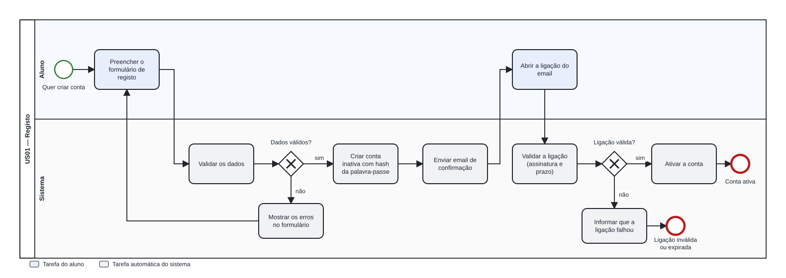

# US01 — Diagrama BPMN: registo e confirmação

O ficheiro editável é [diagrams/bpmn-us01.bpmn](diagrams/bpmn-us01.bpmn) (BPMN 2.0). Abre-se em [demo.bpmn.io](https://demo.bpmn.io) ou no Camunda Modeler: *Open → escolher o ficheiro*. O SVG acima é a imagem para o relatório e para o GitHub.

## Descrição do processo

O processo tem duas pistas: **Aluno** (tarefas a azul: ações da pessoa) e **Sistema** (tarefas a cinzento: passos automáticos).

1. O aluno **quer criar conta** e preenche o formulário de registo.
2. O sistema **valida os dados**. No gateway *Dados válidos?*:
   - **não**: mostra os erros no formulário e o aluno volta a preencher;
   - **sim**: cria a conta **inativa** com o hash da palavra-passe e **envia o email de confirmação**.
3. O aluno **abre a ligação** do email.
4. O sistema **valida a ligação** (assinatura e prazo). No gateway *Ligação válida?*:
   - **sim**: ativa a conta e o processo termina em **Conta ativa**;
   - **não**: informa que a ligação falhou e termina em **Ligação inválida ou expirada**.

## Como o diagrama se liga ao código

| Elemento BPMN | Código |
|---|---|
| Preencher o formulário de registo | `GET /auth/registo` → `templates/auth/register.html` |
| Validar os dados | `validators.validate_registration` (chamado por `services.register_student`) |
| Mostrar os erros no formulário | `routes.register_submit` devolve o formulário com HTTP 422 |
| Criar conta inativa com hash | `services.register_student` → `repository.create_user` |
| Enviar email de confirmação | `mailer.send` (console em desenvolvimento, SMTP em produção) |
| Abrir a ligação do email | `GET /auth/confirmar/<token>` |
| Validar a ligação | `tokens.read_confirmation_token` + comparação do `confirmation_nonce` |
| Ativar a conta | `repository.activate_user` |
| Informar que a ligação falhou | `templates/auth/confirmation.html` (HTTP 400 ou 410) |

## Fora deste processo

Reenvio explícito da ligação, iniciar sessão (US02) e recuperação de palavra-passe. Quando uma ligação expira, o aluno recomeça o registo com o mesmo email (RF01.12).
