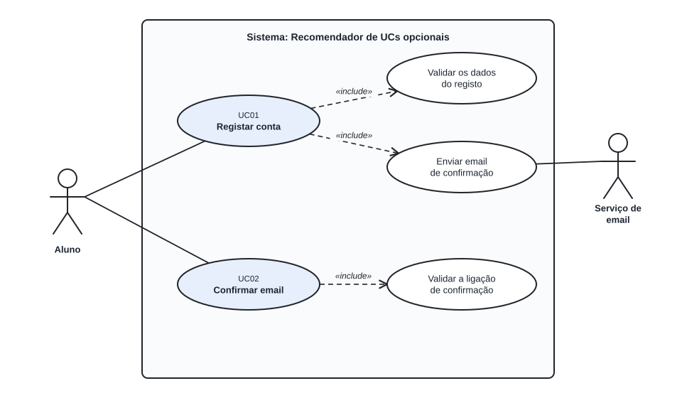

# US01 — Use case: registo com email pessoal

## 1. Atores

| Ator | Tipo | Descrição |
|---|---|---|
| Aluno | Primário | Pessoa com email que quer criar conta para avaliar UCs e receber recomendações. |
| Serviço de email | Secundário | Sistema externo (SMTP) que entrega a mensagem de confirmação. |

## 2. Lista de use cases

| ID | Nome | Relações |
|---|---|---|
| UC01 | Registar conta | inclui *Validar os dados do registo* e *Enviar email de confirmação* |
| UC02 | Confirmar email | inclui *Validar a ligação de confirmação* |

## 3. UC01 — Registar conta

| | |
|---|---|
| **Objetivo** | Criar uma conta de aluno, ainda inativa, e pedir a confirmação do email. |
| **Ator principal** | Aluno |
| **Ator secundário** | Serviço de email |
| **Pré-condições** | O aluno tem um email e consegue aceder à caixa de correio. |
| **Gatilho** | O aluno abre a página de registo. |
| **Requisitos** | RF01.1 a RF01.8, RF01.11 a RF01.15 |

**Fluxo principal**

1. O sistema mostra o formulário de registo.
2. O aluno indica o email, escolhe a palavra-passe, repete-a e aceita a política de privacidade.
3. O aluno submete o formulário.
4. O sistema valida o pedido (token CSRF) e normaliza o email. *(inclui: Validar os dados do registo)*
5. O sistema cria a conta com perfil `aluno`, estado inativo, hash da palavra-passe e registo da aceitação da política.
6. O sistema pede ao serviço de email que envie a ligação de confirmação. *(inclui: Enviar email de confirmação)*
7. O sistema mostra a página «Confirme o seu email». O caso de uso termina.

**Fluxos alternativos**

| ID | Passo | Condição | Resultado |
|---|---|---|---|
| A1 | 4 | Dados inválidos (email mal formado ou fora do domínio configurado, palavra-passe fraca, repetição diferente, política não aceite) | O sistema mostra o formulário com o email preenchido e uma mensagem por campo com erro. Nada é gravado (HTTP 422). Volta ao passo 2. |
| A2 | 4 | Já existe uma conta **ativa** com o email | O sistema rejeita o registo com mensagem clara. Volta ao passo 2. |
| A3 | 5 | Já existe uma conta **por confirmar** com o email | O sistema atualiza a palavra-passe, gera uma nova ligação e invalida as anteriores. Continua no passo 6. |
| A4 | 6 | O email não pode ser enviado | O sistema mostra um erro (HTTP 503). A conta fica pendente. Volta ao passo 2. |
| A5 | 3 | Token CSRF em falta ou inválido | O sistema recusa o pedido (HTTP 400). Nada é gravado. |

**Pós-condições**

- *Sucesso:* existe uma conta inativa e foi enviado um email com ligação válida por 24 horas.
- *Falha:* não foi criada nem alterada nenhuma conta (exceto A4, em que a conta fica pendente).

## 4. UC02 — Confirmar email

| | |
|---|---|
| **Objetivo** | Ativar a conta provando que o aluno controla o email. |
| **Ator principal** | Aluno |
| **Pré-condições** | Existe uma conta pendente e o aluno recebeu a ligação. |
| **Gatilho** | O aluno abre a ligação de confirmação. |
| **Requisitos** | RF01.9, RF01.10 |

**Fluxo principal**

1. O aluno abre a ligação recebida por email.
2. O sistema valida a assinatura, o prazo e a identidade do token. *(inclui: Validar a ligação de confirmação)*
3. O sistema ativa a conta e regista a data de confirmação.
4. O sistema mostra «Conta ativada». O caso de uso termina.

**Fluxos alternativos**

| ID | Passo | Condição | Resultado |
|---|---|---|---|
| A1 | 2 | Ligação adulterada, de outra chave, de utilizador inexistente ou já substituída | O sistema mostra «Ligação inválida» (HTTP 400). A conta mantém-se inativa. |
| A2 | 2 | Ligação fora do prazo | O sistema mostra «Ligação expirada» (HTTP 410) e indica que se pode registar de novo com o mesmo email para receber outra. A conta mantém-se inativa. |
| A3 | 2 | A conta já está ativa | O sistema informa que a conta já está ativa. Nada muda (HTTP 200). |

**Pós-condições**

- *Sucesso:* a conta está ativa (a utilizar na US02 para iniciar sessão).
- *Falha:* a conta mantém o estado anterior.

## 5. Rastreabilidade

| Use case | Requisitos | Código | Testes |
|---|---|---|---|
| UC01 | RF01.1 a RF01.8, RF01.11 a RF01.15 | `app/auth/routes.py`, `services.py`, `validators.py` | `tests/test_registration.py`, `tests/test_validators.py` |
| UC02 | RF01.9, RF01.10 | `app/auth/routes.py` (`confirm`), `services.py`, `tokens.py` | `tests/test_confirmation.py` |
