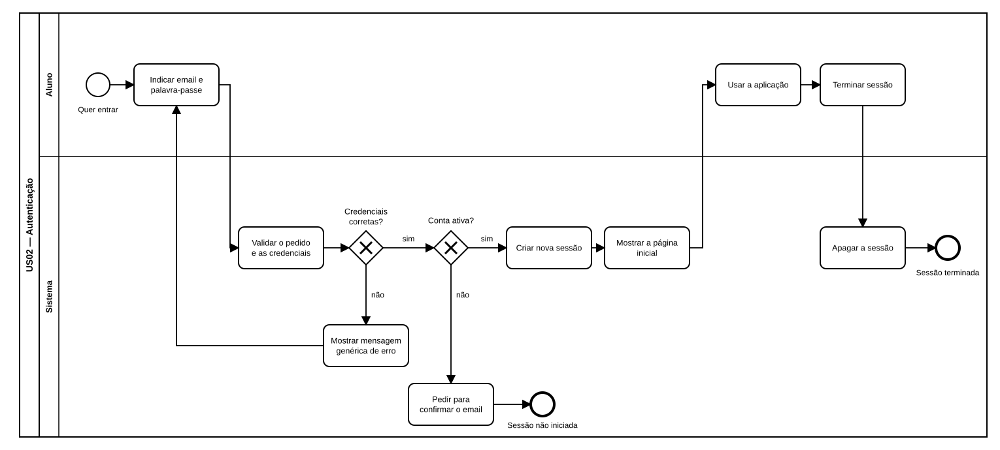

# US02 — Diagrama BPMN: iniciar e terminar sessão

O ficheiro editável é [diagramas/bpmn.bpmn](diagramas/bpmn.bpmn) (BPMN 2.0). Abre-se em [demo.bpmn.io](https://demo.bpmn.io) ou no Camunda Modeler: *Open → escolher o ficheiro*.

## Descrição do processo

O processo tem duas pistas: **Aluno** e **Sistema**.

1. O aluno **quer entrar** e indica o email e a palavra-passe.
2. O sistema **valida o pedido e as credenciais**. No gateway *Credenciais corretas?*:
   - **não**: mostra a mensagem genérica de erro e o aluno volta a preencher;
   - **sim**: segue para o gateway *Conta ativa?*.
3. *Conta ativa?*:
   - **não**: pede para confirmar o email e termina em **Sessão não iniciada**;
   - **sim**: cria uma sessão nova e mostra a página inicial.
4. O aluno **usa a aplicação** e, quando quiser, **termina a sessão**.
5. O sistema **apaga a sessão** e o processo termina em **Sessão terminada**.

## Como o diagrama se liga ao código

| Elemento BPMN | Código |
|---|---|
| Indicar email e palavra-passe | `GET /auth/entrar` → `templates/auth/login.html` |
| Validar o pedido e as credenciais | `security._check_csrf` + `services.authenticate` |
| Mostrar mensagem genérica de erro | `routes.login_submit` devolve o formulário com HTTP 401 |
| Pedir para confirmar o email | `routes.login_submit` com HTTP 403 (`LoginOutcome.INACTIVE`) |
| Criar nova sessão | `sessions.login_user` (limpa a sessão anterior) |
| Mostrar a página inicial | `GET /inicio` → `templates/home.html` |
| Terminar sessão | botão na barra do topo (`templates/base.html`), `POST /auth/sair` |
| Apagar a sessão | `sessions.logout_user` |
