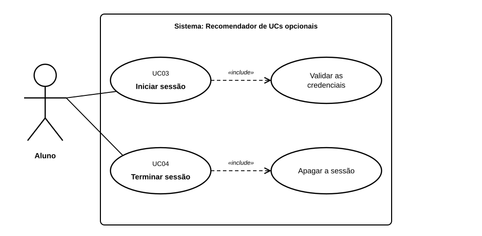

# US02 — Use case: autenticação

## 1. Atores

| Ator | Tipo | Descrição |
|---|---|---|
| Aluno | Primário | Pessoa com conta confirmada (US01) que quer usar a aplicação. |

## 2. Lista de use cases

| ID | Nome | Relações |
|---|---|---|
| UC03 | Iniciar sessão | inclui *Validar as credenciais* |
| UC04 | Terminar sessão | inclui *Apagar a sessão* |

## 3. UC03 — Iniciar sessão

| | |
|---|---|
| **Objetivo** | Entrar na aplicação para aceder às avaliações e recomendações. |
| **Ator principal** | Aluno |
| **Pré-condições** | O aluno tem uma conta registada. |
| **Gatilho** | O aluno abre a página de início de sessão (ou tenta abrir uma página privada). |
| **Requisitos** | RF02.1 a RF02.5, RF02.8 |

**Fluxo principal**

1. O sistema mostra o formulário de início de sessão.
2. O aluno indica o email e a palavra-passe.
3. O sistema valida o pedido (token CSRF), normaliza o email e verifica as credenciais. *(inclui: Validar as credenciais)*
4. O sistema confirma que a conta está ativa.
5. O sistema começa uma sessão nova.
6. O sistema mostra a página inicial do aluno. O caso de uso termina.

**Fluxos alternativos**

| ID | Passo | Condição | Resultado |
|---|---|---|---|
| A1 | 3 | Email inexistente, palavra-passe errada ou campos vazios | Mensagem genérica «Email ou palavra-passe incorretos.» (HTTP 401), com o email preenchido. Volta ao passo 2. |
| A2 | 4 | Conta ainda por confirmar | A sessão não é iniciada; o aluno é informado de que tem de confirmar o email (HTTP 403). |
| A3 | 3 | Token CSRF em falta ou inválido | O pedido é recusado (HTTP 400). |

**Pós-condições**

- *Sucesso:* existe uma sessão com o aluno identificado.
- *Falha:* não há sessão iniciada.

## 4. UC04 — Terminar sessão

| | |
|---|---|
| **Objetivo** | Sair da aplicação. |
| **Ator principal** | Aluno |
| **Pré-condições** | O aluno tem a sessão iniciada. |
| **Gatilho** | O aluno carrega em «Terminar sessão» na barra do topo. |
| **Requisitos** | RF02.6 |

**Fluxo principal**

1. O aluno carrega em «Terminar sessão».
2. O sistema valida o token CSRF e apaga a sessão. *(inclui: Apagar a sessão)*
3. O sistema mostra a página de início de sessão. O caso de uso termina.

**Pós-condições:** as páginas privadas voltam a pedir início de sessão.

## 5. Rastreabilidade

| Use case | Requisitos | Código | Testes |
|---|---|---|---|
| UC03 | RF02.1 a RF02.5, RF02.8 | `app/auth/routes.py` (`login_submit`), `services.py` (`authenticate`), `sessions.py` | `tests/test_login.py` |
| UC04 | RF02.6 | `app/auth/routes.py` (`logout`), `sessions.py` | `tests/test_login.py` (`LogoutTests`) |
