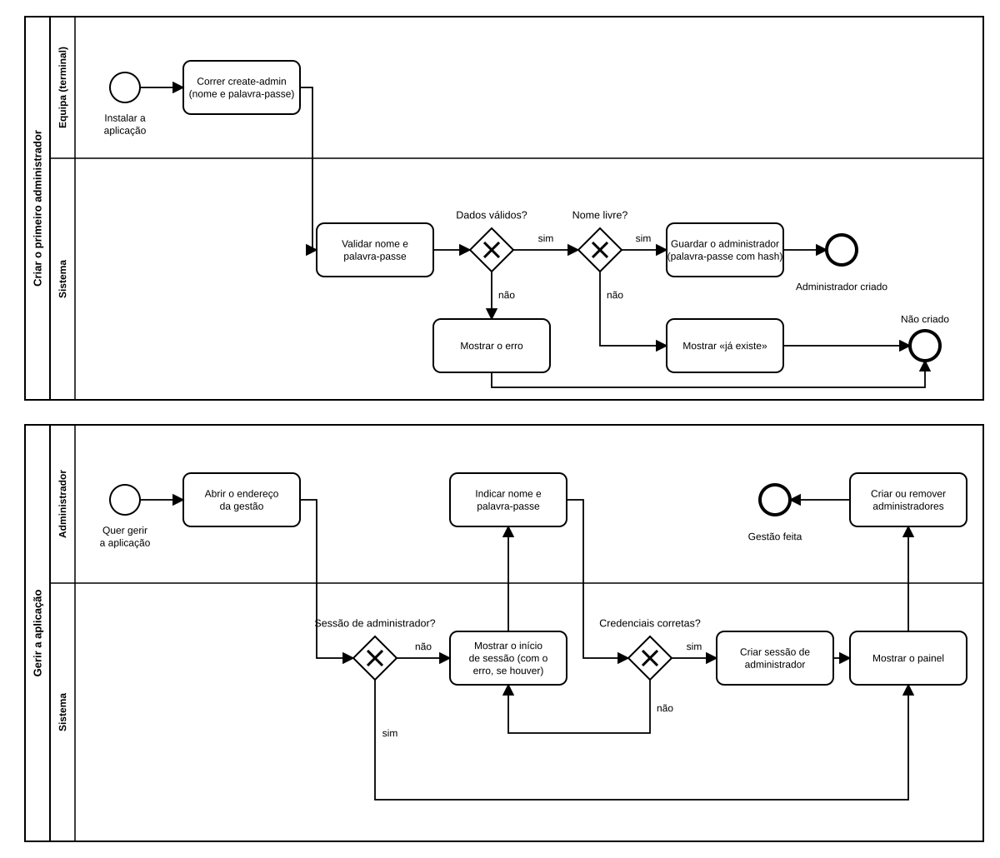

# US03 — Diagrama BPMN: administradores e área de gestão

O ficheiro editável é [diagramas/bpmn.bpmn](diagramas/bpmn.bpmn) (BPMN 2.0), com os dois processos. Abre-se em [demo.bpmn.io](https://demo.bpmn.io) ou no Camunda Modeler.

## Processo 1 — Criar o primeiro administrador (uma vez, no terminal)

1. Depois de **instalar a aplicação**, a equipa corre `create-admin` com o nome e a palavra-passe.
2. O sistema **valida** os dados. *Dados válidos?* **não**: mostra o erro (Não criado).
3. *Nome livre?* **não**: mostra «já existe» (Não criado); **sim**: guarda o administrador com a palavra-passe em hash (Administrador criado).

## Processo 2 — Gerir a aplicação

1. O administrador **abre o endereço da gestão** (não há ligações para ele nas páginas dos alunos).
2. *Sessão de administrador?* **sim**: mostra o painel. **não**: mostra o início de sessão da gestão.
3. O administrador indica nome e palavra-passe. *Credenciais corretas?* **não**: volta ao início de sessão com a mensagem genérica; **sim**: cria a sessão e mostra o painel.
4. No painel, o administrador **cria ou remove administradores**.

## Como o diagrama se liga ao código

| Elemento BPMN | Código |
|---|---|
| Correr create-admin | `app/gestao/cli.py` (`create_admin_command`) |
| Validar nome e palavra-passe / Nome livre? | `services.validate_new_admin`, `services.create_admin` |
| Guardar o administrador | `repository.create` |
| Sessão de administrador? | `sessions.load_current_admin`, `sessions.admin_required` |
| Mostrar o início de sessão | `GET /gestao/entrar` → `templates/gestao/login.html` |
| Credenciais corretas? | `services.authenticate` |
| Criar sessão de administrador | `sessions.login_admin` |
| Mostrar o painel | `GET /gestao/` → `templates/gestao/painel.html` |
| Criar ou remover administradores | `GET/POST /gestao/administradores` → `templates/gestao/administradores.html` |
