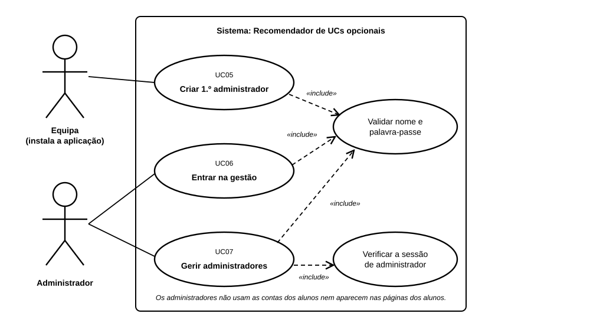

# US03 — Use case: perfis de aluno e administrador

## 1. Atores

| Ator | Tipo | Descrição |
|---|---|---|
| Equipa (instala a aplicação) | Primário (UC05) | Quem tem acesso ao terminal onde a aplicação corre. Só intervém para criar o primeiro administrador. |
| Administrador | Primário (UC06, UC07) | Conta própria na tabela `admins`, sem email. Não é um aluno. |
| Aluno | — | Registado pela US01. Não vê nem acede à área de gestão. |

## 2. Lista de use cases

| ID | Nome | Relações |
|---|---|---|
| UC05 | Criar 1.º administrador | inclui *Validar nome e palavra-passe* |
| UC06 | Entrar na gestão | inclui *Validar nome e palavra-passe* |
| UC07 | Gerir administradores | inclui *Verificar a sessão de administrador* e *Validar nome e palavra-passe* (ao criar) |

## 3. UC05 — Criar 1.º administrador

| | |
|---|---|
| **Objetivo** | Ter o primeiro administrador, para que a partir daí a gestão se faça na aplicação. |
| **Ator principal** | Equipa |
| **Gatilho** | A aplicação foi instalada e ainda não há administradores. |
| **Requisitos** | RF04.3, RF04.4 |

**Fluxo principal:** (1) a equipa corre `flask --app app create-admin`; (2) indica o nome e a palavra-passe (duas vezes); (3) o sistema valida os dados e confirma que o nome está livre; (4) guarda o administrador com a palavra-passe em hash e mostra o endereço da gestão.

**Alternativos:** dados inválidos ou nome repetido → mensagem de erro, nada é criado.

## 4. UC06 — Entrar na gestão

| | |
|---|---|
| **Ator principal** | Administrador |
| **Pré-condições** | Existe a conta de administrador. O administrador conhece o endereço da gestão. |
| **Requisitos** | RF04.5 a RF04.7, RF04.10 |

**Fluxo principal:** (1) o administrador abre o endereço da gestão; (2) o sistema mostra o início de sessão da gestão; (3) o administrador indica nome e palavra-passe; (4) o sistema valida, começa uma sessão de administrador e mostra o painel.

**Alternativos:** credenciais erradas → mensagem genérica, volta ao passo 3; já tem sessão de administrador → vai direto para o painel.

## 5. UC07 — Gerir administradores

| | |
|---|---|
| **Ator principal** | Administrador |
| **Pré-condições** | Sessão de administrador. |
| **Requisitos** | RF04.8, RF04.9 |

**Fluxo principal (criar):** (1) o administrador abre «Administradores»; (2) indica o nome e a palavra-passe do novo administrador; (3) o sistema valida e cria a conta, registando quem a criou.

**Fluxo alternativo (remover):** o administrador carrega em «Remover» noutro administrador; a conta é apagada e a sessão dessa pessoa termina. Não há botão para remover a própria conta.

## 6. Rastreabilidade

| Use case | Requisitos | Código | Testes |
|---|---|---|---|
| UC05 | RF04.3, RF04.4 | `app/gestao/cli.py`, `services.create_admin` | `FirstAdminCommandTests` |
| UC06 | RF04.5 a RF04.7, RF04.10 | `app/gestao/routes.py` (`login_submit`), `sessions.py` | `AdminLoginTests`, `HiddenAreaTests` |
| UC07 | RF04.8, RF04.9 | `app/gestao/routes.py` (`admins_create`, `admins_remove`), `services.py` | `ManageAdminsTests` |
